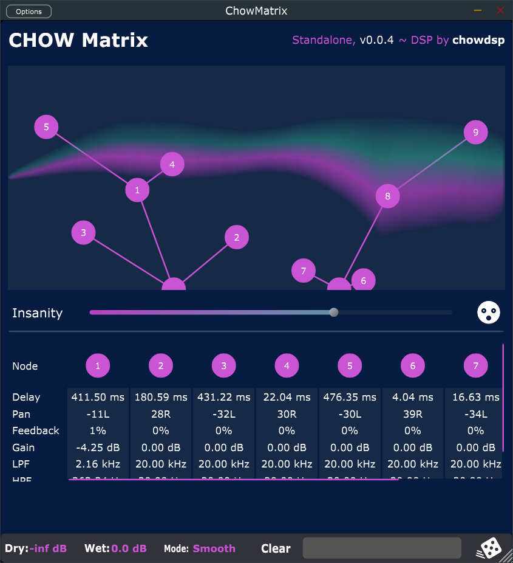

# CHOW Matrix

[](https://travis-ci.com/Chowdhury-DSP/ChowMatrix)
[](https://opensource.org/licenses/BSD-3-Clause)

CHOW Matrix is a delay effect, made up of an inifintely growable
tree of delay lines, each with individual controls for feedback,
panning, distortion, and more. ChowMatrix is available as a VST,
VST3, AU, and Standalone Application.




## Installing

ChowMatrix is currently in pre-release. The latest builds (potentially
unstable) can be downloaded from the [`bin/` directory](https://github.com/Chowdhury-DSP/ChowMatrix/tree/main/bin).


## Building

To build from scratch, you must have CMake installed.

```bash
# Clone the repository
$ git clone https://github.com/Chowdhury-DSP/ChowMatrix.git
$ cd ChowMatrix

# initialize and set up submodules
$ git submodule update --init --recursive

# build with CMake
$ cmake -Bbuild
$ cmake --build build --config Release
```


## Credits

- GUI Design - [Margus Mets](mailto:hello@mmcreative.eu)
- GUI Framework - [Plugin GUI Magic](https://github.com/ffAudio/PluginGUIMagic)
- Dilogarithm function - [Polylogarithm](https://github.com/Expander/polylogarithm)


## License

ChowMatrix is open source, and is licensed under the BSD 3-clause license.
Enjoy!
