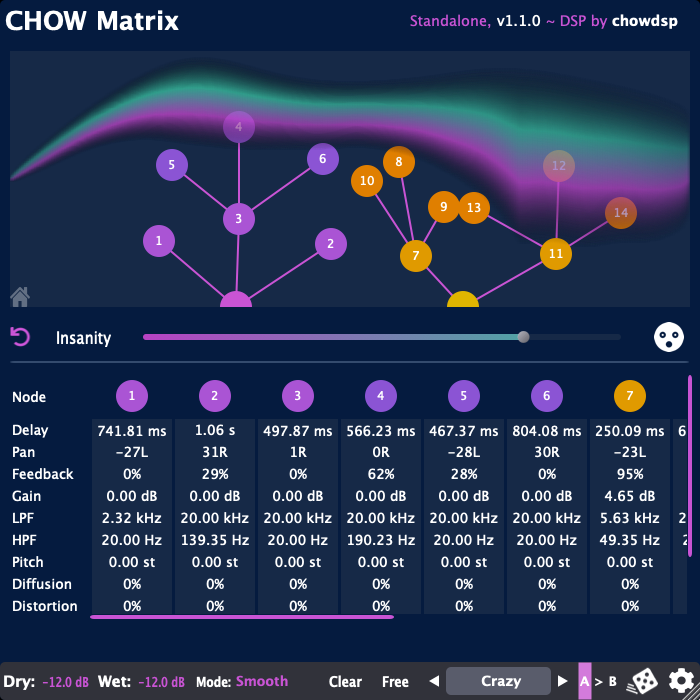

# CHOW Matrix

[](https://github.com/Chowdhury-DSP/ChowMatrix/releases/latest)

[](https://opensource.org/licenses/BSD-3-Clause)
[](https://somsubhra.github.io/github-release-stats/?username=Chowdhury-DSP&repository=ChowMatrix&page=1&per_page=30)

CHOW Matrix is a delay effect, made up of an infinitely growable
tree of delay lines, each with individual controls for feedback,
panning, distortion, and more. ChowMatrix is available as a VST,
VST3, AU, LV2, and Standalone Application.

### Quick Links
- [Latest Release](https://chowdsp.com/products.html#matrix)
- [Nightly Builds](https://chowdsp.com/nightly.html#matrix)
- [User Manual](https://ccrma.stanford.edu/~jatin/chowdsp/Products/ChowMatrixManual.pdf)




## Installing

To download the latest release, visit the
[official website](https://chowdsp.com/products.html#matrix).
If you would like to try the most recent builds (potentially
unstable) check out the
[nightly builds](https://chowdsp.com/nightly.html#matrix).


## Building

To build from source, you must have CMake installed.

```bash
# Clone the repository
$ git clone https://github.com/Chowdhury-DSP/ChowMatrix.git
$ cd ChowMatrix

# initialize and set up submodules
$ git submodule update --init --recursive

# build with CMake
$ cmake -Bbuild
$ cmake --build build --config Release
```


## Credits

- GUI Design - [Margus Mets](mailto:hello@mmcreative.eu)
- GUI Framework - [Plugin GUI Magic](https://github.com/ffAudio/PluginGUIMagic)
- Dilogarithm function - [Polylogarithm](https://github.com/Expander/polylogarithm)
- Extra Icons - [FontAwesome](https://fontawesome.com/)


## License

ChowMatrix is open source, and is licensed under the BSD 3-clause license.
Enjoy!
